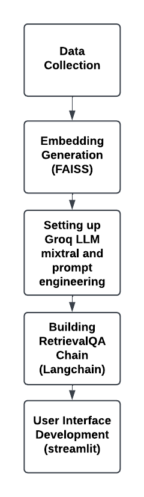

# ANICARE: PetCare AI with Retrieval-Augmented Generation (RAG)

## Overview
This project utilizes Retrieval-Augmented Generation (RAG) to create an AI-powered assistant for pet care and veterinary clinical pathology. It integrates Groq's LLM (Large Language Model) for answering questions based on context retrieved from embedded documents using FAISS embeddings.

## Project Structure

- **app.py**: Streamlit application for user interaction and querying.
- **data/**: Contains PDFs and datasets used for embedding and context retrieval.
- **requirements.txt**: Dependencies required to run the project.
- **scripts/**:
  - `create_embeddings.py`: Script to generate FAISS embeddings from PDFs.
  - Other scripts for running LLMs and handling Groq APIs.
- **vectorstore_faiss/**: Directory for storing FAISS indexes.

## Setup Instructions

### Environment Setup
1. Clone the repository:
   ```bash
   cd petcare-rag
   ```

2. Install dependencies:
   ```bash
   pip install -r requirements.txt
   ```

### Data Preparation
- Download the PDFs and place them in the `data/` directory:
  - [Veterinary Clinical Pathology: A Case-Based Approach](https://vetbooks.ir/veterinary-clinical-pathology-a-case-based-approach/) (Other PDFs as necessary)

### Setting Up Groq API Key
1. Obtain your Groq API key from [Groq](https://groq.com/).
   
2. Place your API key in `app.py`:
   ```python
   os.environ["GROQ_API_KEY"] = "your_groq_api_key_here"
   ```

### Running the Application
Run the Streamlit app:
   ```bash
   streamlit run app.py
   ```

## Flowchart



This flowchart illustrates the process of how the RAG-based PetCare AI works, from user input to generating responses based on retrieved contexts and embeddings.

## Additional Notes
- Ensure proper data handling and privacy compliance when dealing with sensitive information.
- Continuously update embeddings and retrain models as new data becomes available for improved accuracy.

